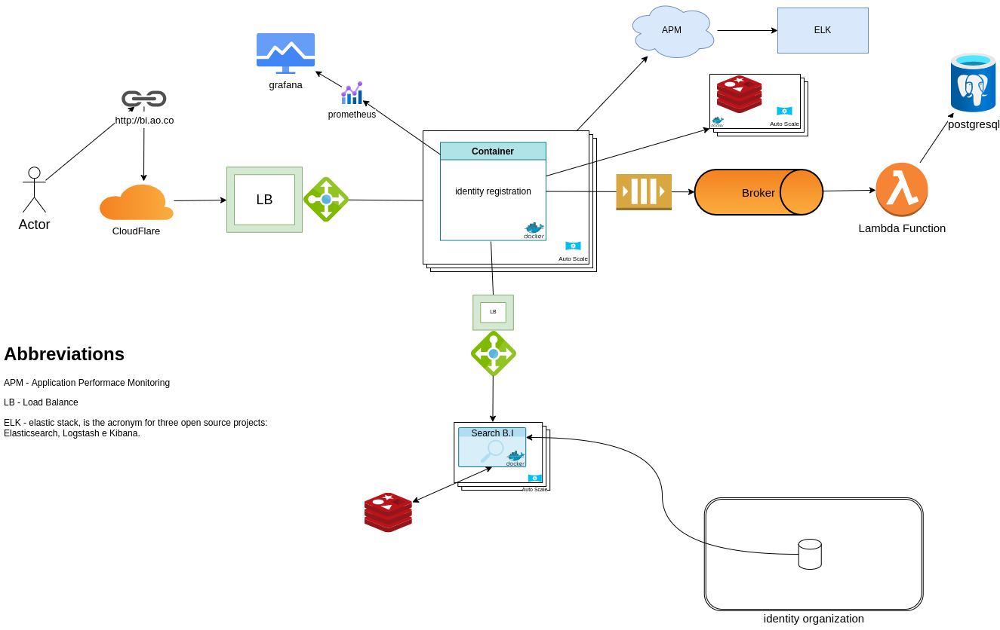

Marking
- B.I Issue First time - 1st Copy
- Expired B.I Reissue of Identity Card – 2nd Copy

step
- manage appointment requests
- use the institution's data to verify second copy B.I requests

estimated traffic
* 1 requisition - creates 1 Booking Request
* 120 Requests per minute.
* 120 requests in 1 week 168 hours estimated 20,160 thousand requests per week.
* 200 concurrent users
* Estimated at 2000 RPM

1- Who is going to use it?

R: *1st, 2nd and 3rd age*.

2- How are they going to use it?

R: schedule order.

3- How many users are there?

R: estimated more than 5000 thousand.

4- What does the system do?

R: Scheduling orders for B.I identity registration.

5- What are the inputs and outputs of the system?

R: ...

6- How much data do we expect to handle?

R: ...

7- How many requests per second do we expect?

R: 7.200s

What is the expected read to write ratio?

R: ...

## Decisions
**cloudflare** - keeps applications and APIs secure and productive, thwarts DDoS attacks,rate limiting, keeps bots at bay, detects anomalies and malicious payloads. At the moment use will be free.

**Redis** - quite often your database server may be under high loads for lots of writes or reads operations. Quite often we hit the database for various queries and joins which slows down the performance of the system.

Caching improves page load times and can reduce the load on your servers and databases.

... continue

### Steps to use edit design draw io

1- fork the project

2- open draw io design application

download extension Vscode https://marketplace.visualstudio.com/items?itemName=hediet.vscode-drawio

download app https://www.diagrams.net/

Open in Web https://app.diagrams.net/

3 - add from github

4- select forked project

